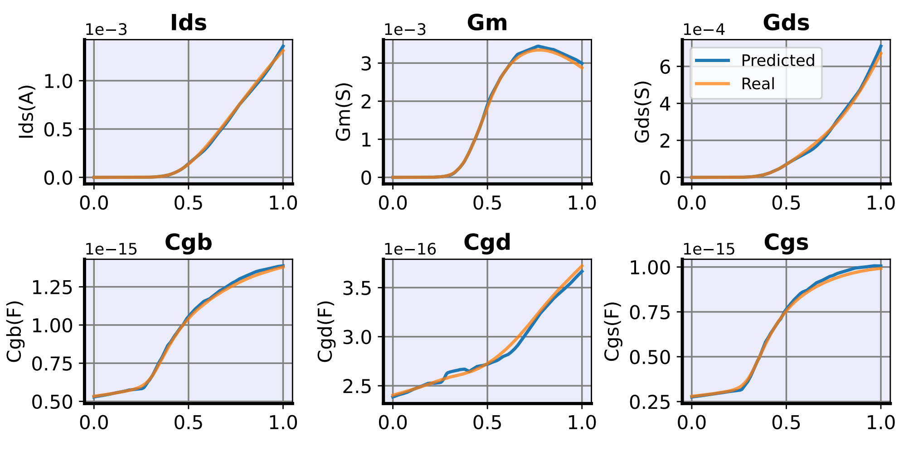

# BSIMAR: An Autoregressive Compact Model

[](https://opensource.org/licenses/MIT)
[](https://www.python.org/downloads/release/python-310/)
[](https://pytorch.org/)
[](https://pytorch-geometric.readthedocs.io/)

Official implementation of the paper "An Autoregressive Compact Model".

## 📑 Table of Contents

- [Overview](#overview)
- [Key Features](#key-features)
- [Repository Structure](#repository-structure)
- [Installation](#installation)
- [Usage](#usage)
  - [Dataset Preparation](#dataset-preparation)
  - [Model Training](#model-training)
  - [Evaluation](#evaluation)
- [Framework Components](#framework-components)
- [Results](#results)
- [Citation](#citation)
- [License](#license)

## 🔍 Overview

BSIMAR, an autoregressive compact model that leverages large generative models to provide high accuracy, reduced calibration effort, and seamless integration into design workflows

Our framework supports simultaneous prediction of three target types:

- Predict the current-voltage (I-V) curve
- Predict the capacitance-voltage (C-V) curve
- Predict the charge-voltage (Q-V) curve:


## ✨ Key Features

BSIMAR addresses these challenges in Compact Model:

1. **Unified Autoregressive Modeling** - Given the process parameters and terminal voltages,our single AR model generates all key performance characteristics—including I-V, Q-V, and C-V curves—at once
2. **High Accuracy via Scaling Law** - Pre-training followed by fine-tuning enables the model to achieve high accuracy and strong generalization
3. **Scalable Simulation Acceleration** - The parallelization capability enables accelerated simulation of large-scale AMS circuits


## 📁 Repository Structure

```
.
├── balanced_mse.py          # Implementation of balanced MSE loss functions
├── downstream_train.py      # Training script for downstream tasks
├── main.py                  # Main entry point for the training pipeline
├── model.py                 # GNN model architecture definitions
├── requirements.txt         # Python dependencies
├── sampling.py              # Graph sampling utilities
├── sgrl_models.py           # Self-supervised graph contrastive learning models
├── sgrl_train.py            # Training script for contrastive learning
├── sram_dataset.py          # Dataset loading and preprocessing
└── utils.py                 # Utility functions
```

## 💻 Installation

### Prerequisites

- Python 3.10+
- CUDA-compatible GPU (recommended)

### Setup Instructions

```bash
# Clone the repository
git clone https://github.com/username/BSIMAR.git
cd BSIMAR

# Create and activate a conda environment
conda create -n BSIMAR python=3.10
conda activate BSIMAR

# Install dependencies
pip install -r requirements.txt
```

## 🚀 Usage

### Models

#### Models Download Instructions

The datasets used for training and testing CircuitGCL are available for download via the following links. You can use `curl` to directly download these files from the provided URLs.

##### List of Datasets

| Model                                                                                | size<br><sup>(pixels) | mAP<sup>val<br>50-95 | Speed<br><sup>CPU ONNX<br>(ms) | Speed<br><sup>T4 TensorRT10<br>(ms) | params<br><sup>(M) | FLOPs<br><sup>(B) |
| ------------------------------------------------------------------------------------ | --------------------- | -------------------- | ------------------------------ | ----------------------------------- | ------------------ | ----------------- |
| [YOLO11n](https://github.com/ultralytics/assets/releases/download/v8.3.0/yolo11n.pt) | 640                   | 39.5                 | 56.1 ± 0.8                     | 1.5 ± 0.0                           | 2.6                | 6.5               |
| [YOLO11s](https://github.com/ultralytics/assets/releases/download/v8.3.0/yolo11s.pt) | 640                   | 47.0                 | 90.0 ± 1.2                     | 2.5 ± 0.0                           | 9.4                | 21.5              |

##### Using `curl` to Download

To download any of the datasets using `curl`, you can use the following command format in your terminal:

```bash
curl -O <download_link>
```

For example, to download the SSRAM dataset, you would run:

```bash
curl -O https://circuitgcl-sram.s3.ap-southeast-2.amazonaws.com/raw/ssram.pt
```

Replace `<download_link>` with the appropriate URL from the table above.

##### Dataset Statistics

Below is a summary of the statistics for each dataset as used in our experiments:

| Split       | Dataset         | N    | NE    | #Links |
| ----------- | --------------- | ---- | ----- | ------ |
| Train.&Val. | SSRAM           | 87K  | 134K  | 131K   |
| Test        | DIGITAL_CLK_GEN | 17K  | 36K   | 4K     |
|             | TIMING_CTRL     | 18K  | 44K   | 5K     |
|             | ARRAY_128_32    | 144K | 352K  | 110K   |
|             | ULTRA8T         | 3.5M | 13.4M | 166K   |
|             | SANDWICH-RAM    | 4.3M | 13.3M | 154K   |

Note: The number of nodes (N), edges (NE), and links (#Links) are provided for reference to give an idea of the scale and complexity of each dataset.

---

#### Dataset Usage

Place your circuit datasets in the `./datasets/raw/` directory. The framework supports multiple SRAM circuit designs:

```
datasets/raw/
├── ssram.pt
├── digtime.pt
├── timing_ctrl.pt
├── array_128_32_8t.pt
├── ultar8t.pt
├── sandwich.pt
└── ...
```

### Model Training

#### Basic Training

```bash
# For node classification task
python main.py --dataset ssram+digtime+timing_ctrl+array_128_32_8t --task classification --task_level node --batch_size 128

# For edge regression task with GAI loss
python main.py --dataset ssram+digtime+timing_ctrl+array_128_32_8t --task regression --task_level edge --regress_loss gai --batch_size 128
```

#### With Contrastive Learning

```bash
# Enable contrastive learning pre-training
python main.py --dataset ssram+digtime+timing_ctrl+array_128_32_8t --task classification --sgrl 1 --cl_epochs 800
```

### Key Arguments

| Argument         | Description                          | Options                                                   |
| ---------------- | ------------------------------------ | --------------------------------------------------------- |
| `--task`         | Task type                            | `classification`, `regression`                            |
| `--task_level`   | Prediction level                     | `node`, `edge`                                            |
| `--dataset`      | Names of datasets (separated by `+`) | e.g., `ssram+digtime`                                     |
| `--model`        | GNN model architecture               | `clustergcn`, `resgatedgcn`, `gat`, `gcn`, `sage`, `gine` |
| `--sgrl`         | Enable contrastive learning          | `0` (disabled), `1` (enabled)                             |
| `--regress_loss` | Regression loss function             | `mse`, `gai`, `bmc`, `bni`, `lds`                         |
| `--class_loss`   | Classification loss function         | `bsmCE`, `focal`, `cross_entropy`                         |
| `--batch_size`   | Training batch size                  | Integer (default: `128`)                                  |
| `--cl_epochs`    | Contrastive learning epochs          | Integer (default: `500`)                                  |

## 🧠 Framework Components

### 1. Self-supervised Graph Contrastive Learning (SGRL)

Our SGRL module enables better transferability across different circuit designs by learning circuit structure representations without relying on parasitic labels. Key features include:

- Structure-aware graph augmentation strategies
- Circuit-specific positive/negative sampling techniques
- Efficient contrastive objective functions

### 2. Graph Neural Network Architectures

Multiple state-of-the-art GNN architectures are supported:

- **Graph Convolutional Network (GCN)** - For basic graph representation learning
- **GraphSAGE** - For efficient neighborhood sampling and aggregation
- **Graph Attention Network (GAT)** - For attention-based message passing
- **Residual Gated GCN** - For complex edge-conditioned convolutions
- **Graph Isomorphism Network with Edge features (GINE)** - For enhanced expressivity
- **Cluster GCN** - For efficient training on large circuit graphs

### 3. Label Rebalancing Strategies

Several advanced techniques are implemented to handle the severely imbalanced distribution of parasitic capacitance values:

- **Generative-based Adaptive Importance Loss (GAI)** - Our proposed approach that adaptively weights samples based on frequency distribution
- **Balanced MSE Loss** - Reweights the loss based on inverse sample frequency
- **Balanced Negative Sampling** - Improves representation learning for rare parasitic values
- **Local Distribution Smoothing (LDS)** - Reduces distribution bias during training
- **Focal Loss** - Focuses on hard-to-predict parasitic values

## 📊 Results

Our approach delivers better performance compared to existing model architectures.

### Predicted I-V and C-V curves



### SRAM simulation


#### Complete Performance Comparison Table

| Model             | $I_{ds}$   | $g_m$     | $g_{ds}$  | $Q_g$     | $Q_b$     | $Q_d$     | $C_{gg}$  | $C_{gd}$  | $C_{gs}$  | Average   |
|-------------------|------------|-----------|-----------|-----------|-----------|-----------|-----------|-----------|-----------|-----------|
| LogicTree         | 22.21%     | 32.13%    | 36.21%    | 62.31%    | 14.48%    | 21.75%    | 19.42%    | 23.37%    | 29.61%    | 29.05%    |
| ANN               | 31.78%     | 24.17%    | 16.52%    | 20.30%    | 22.09%    | 18.30%    | 7.74%     | 14.85%    | 9.40%     | 18.35%    |
| MLP               | 5.18%      | 16.37%    | 10.95%    | 14.80%    | 9.44%     | 17.54%    | 4.94%     | 12.66%    | 4.43%     | 10.70%    |
| E-D               | 41.54%     | 35.84%    | 39.09%    | 38.98%    | 28.18%    | 22.19%    | 16.48%    | 14.26%    | 15.99%    | 28.06%    |
| ZS BSIMAR         | 14.1%      | 11.4%     | 14.6%     | 16.3%     | 4.06%     | 13.6%     | 2.18%     | 3.10%     | 5.27%     | **9.41%** | 
| FT BSIMAR         | 11.1%      | 8.73%     | 8.94%     | 11.84%    | 6.61%     | 7.80%     | 2.93%     | 1.55%     | 3.42%     | **6.99%** |


#### Zero-Shot VS Fine-Tuning MRE

| Tech. Device | $I_{ds}$ | $g_m$ | $g_{ds}$ | $Q_g$ | $Q_b$ | $Q_d$ | $C_{gg}$ | $C_{gd}$ | $C_{gs}$ | Average |
|--------------|----------|-------|----------|-------|-------|-------|----------|----------|----------|---------|
| **7nm**      |          |       |          |       |       |       |          |          |          |         |
| nch_svt      | 14.1%    | 11.4% | 14.6%    | 16.3% | 4.06% | 13.6% | 2.18%    | 3.10%    | 5.27%    | 9.41%   |
| nch_svt+ft   | 11.1% -2.98% | 8.73% -2.71% | 8.94% -5.70% | 11.84% -4.50% | 6.61% +2.55% | 7.80% -5.80% | 2.93% +0.75% | 1.55% -1.55% | 3.42% -1.85% | 6.99% -2.42% |
| nch_lvt      | 15.7%    | 12.8% | 15.4%    | 12.1% | 8.85% | 11.4% | 2.48%    | 3.43%    | 4.85%    | 9.67%   |
| nch_lvt+ft   | 5.37% -10.30% | 6.14% -6.69% | 3.99% -11.43% | 10.85% -1.21% | 5.68% -3.17% | 7.15% -4.28% | 3.24% +0.76% | 1.45% -1.98% | 2.66% -2.19% | 5.17% -4.50% |
| pch_svt      | 10.9%    | 12.7% | 4.33%    | 32.1% | 8.29% | 26.3% | 5.57%    | 5.67%    | 6.39%    | 12.5%   |
| pch_svt+ft   | 10.9% -0.08% | 6.09% -6.59% | 8.67% +4.34% | 23.1% -8.95% | 5.97% -2.32% | 18.5% -7.79% | 7.75% +2.18% | 3.92% -1.75% | 7.89% +1.50% | 10.3% -2.16% |
| pch_lvt      | 9.46%    | 20.8% | 6.27%    | 41.6% | 29.3% | 32.9% | 8.12%    | 5.28%    | 8.34%    | 18.0%   |
| pch_lvt+ft | 11.4% +1.95% | 17.6% -3.20% | 23.8% +17.6% | 13.9% -27.5% | 11.13% -18.1% | 12.5% -20.5% | 7.33% -0.79% | 4.97% -0.31% | 7.82% -0.52% | 12.3% -5.73% |
| **12nm**     |          |       |          |       |       |       |          |          |          |         |
| nch_svt      | 7.26%    | 14.6% | 21.9%    | 14.4% | 12.3% | 5.20% | 1.52%    | 1.58%    | 2.11%    | 9.00%   |
| nch_svt+ft   | 4.99% -2.27% | 7.21% -7.36% | 17.69% -4.26% | 11.8% -2.58% | 1.76% -10.5% | 10.2% +4.98% | 2.09% +0.57% | 1.31% -0.27% | 3.00% +0.89% | 6.67% -2.32% |
| nch_lvt      | 6.42%    | 10.8% | 18.8%    | 15.1% | 11.7% | 6.49% | 1.35%    | 1.61%    | 2.95%    | 8.36%   |
| nch_lvt+ft   | 8.28% +1.86% | 4.80% -5.98% | 4.63% -14.20% | 7.64% -7.49% | 4.09% -7.63% | 7.92% +1.43% | 2.28% +0.93% | 1.99% +0.38% | 2.65% -0.30% | 4.92% -3.44% |
| pch_svt      | 4.82%    | 14.0% | 7.37%    | 18.4% | 6.00% | 7.30% | 1.81%    | 1.34%    | 2.30%    | 7.04%   |
| pch_svt+ft   | 3.38% -1.44% | 5.88% -8.16% | 23.1% +15.7% | 5.61% -12.8% | 2.00% -4.00% | 6.01% -1.29% | 1.33% -0.48% | 1.20% -0.14% | 1.79% -0.51% | 5.59% -1.45% |
| pch_lvt      | 10.09%   | 17.5% | 7.95%    | 20.4% | 3.73% | 10.4% | 2.24%    | 2.78%    | 2.95%    | 8.67%   |
| pch_lvt+ft   | 3.47% -6.62% | 4.56% -12.9% | 14.1% -3.89% | 16.5% -3.89% | 6.67% +2.94% | 8.73% -1.70% | 2.29% +0.05% | 1.56% -1.22% | 2.32% -0.63% | 6.69% -1.98% |
| **16nm**     |          |       |          |       |       |       |          |          |          |         |
| nch_svt      | 7.13%    | 9.39% | 28.5%    | 14.46% | 10.5% | 7.03% | 2.65%    | 2.30%    | 4.40%    | 9.60%   |
| nch_svt+ft   | 5.86% -1.27% | 7.19% -2.20% | 1.43% -27.09% | 6.19% -8.27% | 2.17% -8.35% | 4.71% -2.32% | 1.50% -1.15% | 1.65% -0.65% | 2.18% -2.22% | 3.65% -5.95% |
| nch_lvt      | 5.12%    | 7.47% | 23.13%   | 13.6% | 13.7% | 5.67% | 2.22%    | 2.22%    | 4.18%    | 8.60%   |
| nch_lvt+ft   | 7.23% +2.11% | 7.28% -0.19% | 11.06% -12.1% | 10.1% -3.57% | 6.21% -7.52% | 12.33% +6.66% | 2.43% +0.21% | 2.27% +0.05% | 2.86% -1.32% | 6.86% -1.74% |
| pch_svt      | 5.14%    | 8.43% | 21.97%   | 16.9% | 4.94% | 5.68% | 1.34%    | 1.81%    | 2.32%    | 7.61%   |
| pch_svt+ft   | 4.60% -0.54% | 9.83% +1.40% | 8.25% -13.72% | 7.38% -9.47% | 3.16% -1.78% | 7.46% +1.78% | 1.78% +0.44% | 0.75% -1.06% | 2.84% +0.52% | 5.12% -2.49% |
| pch_lvt      | 11.2%    | 16.2% | 19.6%    | 25.6% | 4.76% | 11.4% | 1.07%    | 1.85%    | 1.93%    | 10.4%   |
| pch_lvt+ft   | 4.33% -6.85% | 5.71% -10.5% | 4.96% -14.6% | 7.77% -17.79% | 2.27% -2.49% | 5.12% -6.23% | 1.40% +0.33% | 1.43% -0.42% | 1.93% +0.00% | 3.88% -6.51% |
## 📝 Citation

If you find this work useful for your research, please consider citing:

```bibtex
@article{BSIMAR2025,
  title={An Autoregressive Compact Model},
  author={Author1 and Author2 and Author3},
  journal={Conference/Journal Name},
  year={2025},
  publisher={Publisher}
}
```

## 📄 License

This project is licensed under the MIT License - see the LICENSE file for details.


